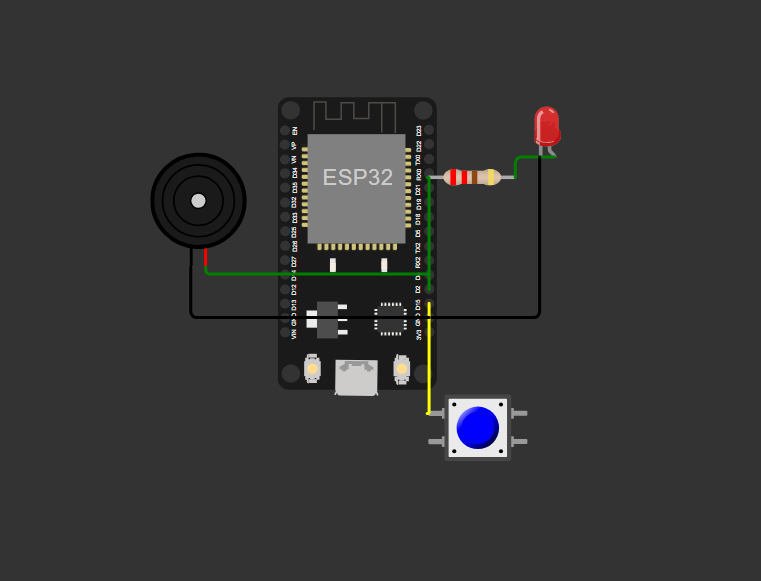
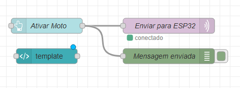

# Projeto EchoBeacon para Mottu 🏍️

# Integrantes
* **Gustavo Lopes Santos da Silva** - RM: 556859
* **Renato de Freitas David Campiteli** - RM: 555627
* **Gabriel Santos Jablonski** - RM: 555452

## Resumo da solução

O projeto EchoBeacon visa implementar uma solução tecnológica para melhorar a organização e a localização das motos no pátio da empresa Mottu. O sistema será composto por uma série de componentes integrados, incluindo:

1. **EchoBeacon**: Dispositivos eletrônicos de tamanho reduzido instalados em cada moto para facilitar a identificação e o alarme.
2. **Sistema de Cadastro de Motos**: Desenvolvido com Java e NextJS para registrar informações detalhadas sobre as motos, incluindo chassi e problemas específicos.
3. **Aplicativo Móvel**: Conectado ao banco de dados centralizado para fornecer acesso aos colaboradores para consultar informações e localizar as motos.
4. **Banco de Dados Centralizado**: Armazena todas as informações relevantes sobre as motos, permitindo uma gestão eficiente.

### Funcionalidades do EchoBeacon ⚙️

- **Identificação Rápida**: Usando um sistema de som (pequeno alarme) e LED/farol.
- **Registro em Banco de Dados**: Quando uma moto chega ao pátio, suas informações são registradas para consulta posterior.

### Acesso aos Colaboradores

- **Consulta Detalhada**: Informações como placa, chassi e problema do veículo podem ser consultadas no aplicativo móvel.
- **Localização das Motos**: Funcionalidade para ativar o alarme e o LED da tag associada à moto selecionada, facilitando sua localização.

### Solução

Este sistema visa resolver o problema de localizar rapidamente as motos no pátio. Com a implementação desse sistema, a Mottu poderá organizar melhor suas motos e otimizar o tempo gasto na identificação e localização dos veículos dentro do pátio, garantindo uma gestão mais ágil e eficiente.

## Tecnologia Utilizada 💻

- **Microcontrolador ESP32**: Para o desenvolvimento do EchoBeacon.
- **Java**: Para o sistema de cadastro de motos.
- **React-Native**: Para a interface mobile.
- **Node-RED**: Para processamento de dados MQTT e visualização em um painel de controle.

### Configuração Wokwi 🕹️

  

### Configuração do Node-RED 🛜

  

